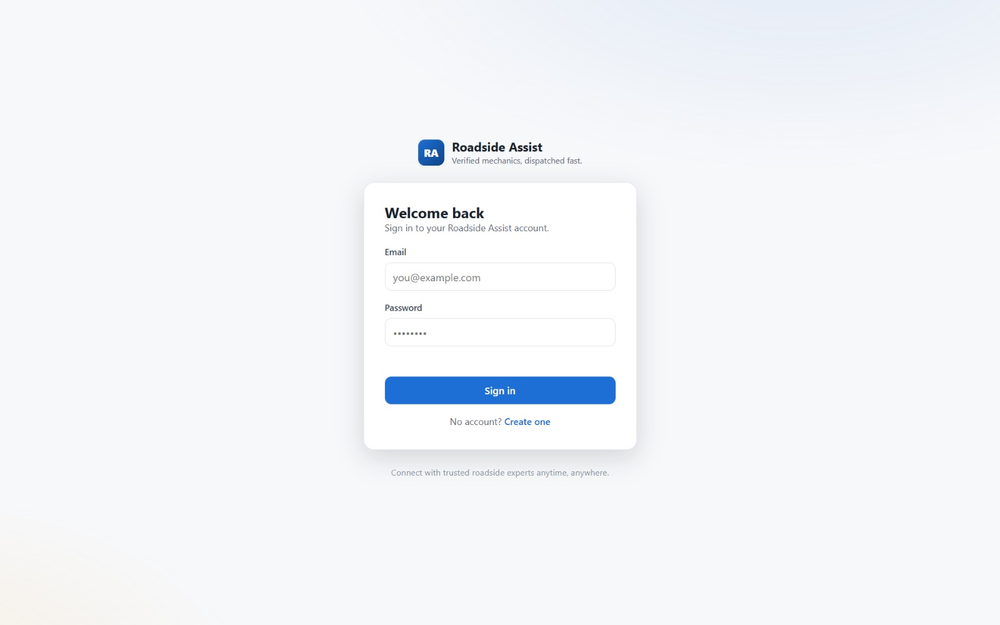
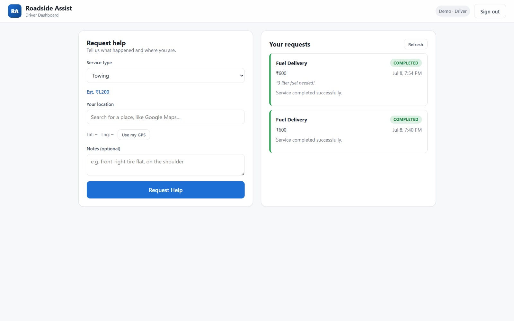
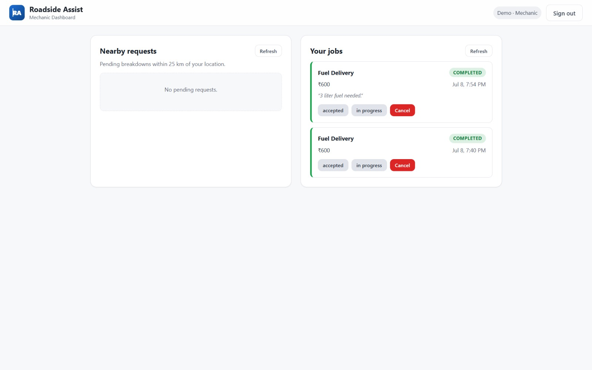
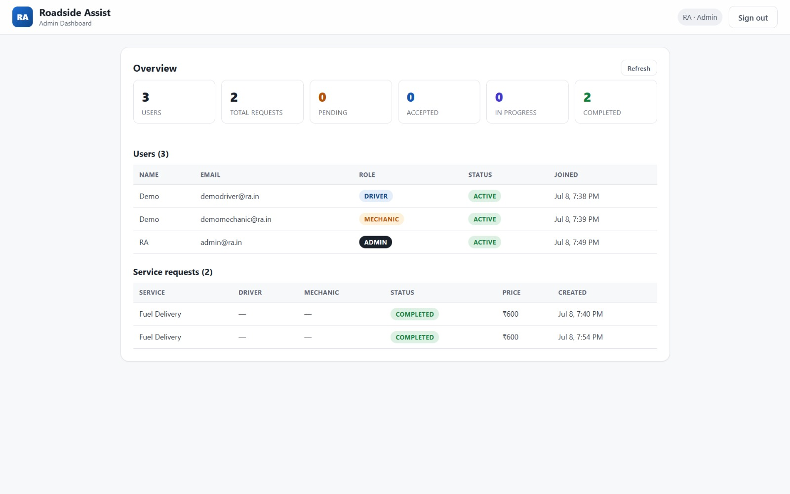

# 🚗 Roadside Vehicle Assistance

## Overview

Roadside Vehicle Assistance is a full-stack web application that connects drivers with nearby mechanics during vehicle breakdowns. The system provides role-based dashboards for Drivers, Mechanics, and Administrators while storing all application data in MongoDB Atlas.

---

## Features

✅ JWT Authentication

✅ MongoDB Atlas Database

✅ Driver Dashboard

✅ Mechanic Dashboard

✅ Admin Dashboard

✅ Request Tracking

✅ Location Search

✅ GPS Support

✅ Secure Password Hashing

---

## Technology Stack

Frontend

• Vite
• TypeScript
• HTML
• CSS

Backend

• Express.js
• Node.js
• MongoDB Atlas
• Mongoose

Authentication

• JWT
• bcryptjs

---

## Installation

git clone ...

npm install

Create .env

npm run dev

---

## Screenshots

### Login Page

---

### Driver Dashboard

---

### Mechanic Dashboard

---

### Admin Dashboard

## Author

Durgesh Bodke